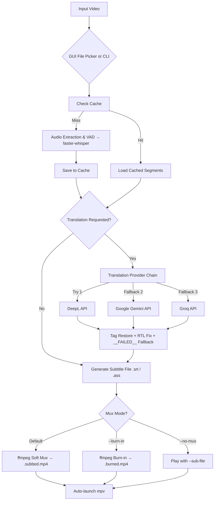

# 🎬 Autosub Player

[](https://www.python.org/)
[](https://opensource.org/licenses/MIT)
[](https://github.com/SYSTRAN/faster-whisper)
[](https://mpv.io/)
[](https://github.com/SDAIAAcademy)

**Autosub Player** is an intelligent, high-performance video subtitle generator and player. It transcribes audio tracks locally using [faster-whisper](https://github.com/SYSTRAN/faster-whisper), optionally translates subtitles using a resilient multi-provider AI translation fallback chain (**DeepL**, **Google Gemini**, and **Groq**), auto-muxes subtitles into the video via **ffmpeg**, and launches [mpv](https://mpv.io) for seamless playback.

---

## 🌟 Key Features

- 🎙️ **Multi-Engine Transcription**: Powered by a unified backend supporting `faster-whisper`, `Qwen3-ASR`.
  - **Auto-Selection**: Automatically uses `Canary-Qwen` for English, and `Qwen3-ASR` with Forced Alignment for everything else.
  - Features Voice Activity Detection (VAD) and automatic language detection.
- ⚡ **Hardware Acceleration**: Automatic GPU (`CUDA` / float16 / bfloat16) acceleration with seamless fallback to CPU (`int8`) for Whisper.
- 🌐 **Multi-Provider AI Translation Chain**:
  - Resilient translation fallback across **DeepL**, **Google Gemini (Gemini 2.5 Flash)**, and **Groq (Llama 3.3 70B)**.
  - Customizable provider order via `--provider-order`.
  - Automatic quota/rate-limit switching and retry mechanisms.
  - Proper SDK-specific exception handling (no string-sniffing).
  - Subtitle styling tag preservation (ASS/SSA tags stay in their original positions).
- 🌍 **RTL & Arabic Subtitle Support**: Built-in bidirectional unicode formatting for right-to-left languages.
- 🎥 **Automatic Subtitle Muxing**: Embeds subtitles directly into the video via ffmpeg (stream copy, no re-encode).
- 🔥 **Optional Burn-In**: Hardcode subtitles into the video frames with `--burn-in` for maximum compatibility.
- 🎨 **Modern Dark-Themed GUI & CLI**: Sleek desktop file picker + comprehensive command-line interface.
- 📺 **Instant Playback**: Auto-launches mpv after processing.
- 💾 **Smart Caching**: Transcription results are cached centrally (`~/.autosub_cache/`) — re-running translation on the same video skips re-transcription.
- 📄 **`.env` File Support**: Load API keys from a `.env` file via `python-dotenv`.
- 🚀 **One-Click Windows Launcher**: `Start.bat` handles venv setup and launch.

---

## 🏗️ Architecture & Workflow



---

## 📋 Prerequisites & System Dependencies

### 1. Python
- **Python 3.10+** installed and added to your system `PATH`.

### 2. External Tools
- **[FFmpeg](https://ffmpeg.org/)**: Required for audio extraction, subtitle muxing, and burn-in. Must be on your system `PATH`.
- **[mpv](https://mpv.io/)**: Required for automatic video playback. Must be on your system `PATH`.
- *(Linux only)* **Tkinter**: Install `python3-tk` (e.g., `sudo apt-get install python3-tk`).

### 3. GPU Acceleration (Optional)
- **NVIDIA GPU** with CUDA Toolkit and cuDNN for faster float16 transcription inference. Falls back to CPU `int8` automatically.

---

## 🚀 Installation & Quick Start

### Option A: Windows One-Click Start (Recommended)
Simply double-click:
```bash
Start.bat
```
This script will automatically:
1. Create a Python virtual environment (`.venv`).
2. Install all required dependencies from `requirements.txt`.
3. Launch the Autosub Player GUI.

---

### Option B: Manual Setup

1. **Clone the repository:**
   ```bash
   git clone https://github.com/YOUR_USERNAME/audio-to-text.git
   cd "audio to text"
   ```

2. **Create and activate a virtual environment:**
   - **Windows:**
     ```bash
     python -m venv .venv
     .\.venv\Scripts\activate
     ```
   - **Linux / macOS:**
     ```bash
     python3 -m venv .venv
     source .venv/bin/activate
     ```

3. **Install Python dependencies:**
   ```bash
   pip install -r requirements.txt
   ```

---

## 🔑 Translation API Keys Setup (Optional)

Set one or more API keys via **environment variables** or a **`.env` file** in the project directory:

### Using a `.env` file (recommended):
Create a `.env` file in the project root:
```env
DEEPL_API_KEY=your_deepl_api_key_here
GEMINI_API_KEY=your_gemini_api_key_here
GROQ_API_KEY=your_groq_api_key_here
```

### Using environment variables:
- **Windows (PowerShell):**
  ```powershell
  $env:GEMINI_API_KEY="your_gemini_api_key_here"
  $env:GROQ_API_KEY="your_groq_api_key_here"
  $env:DEEPL_API_KEY="your_deepl_api_key_here"
  ```
- **Linux / macOS:**
  ```bash
  export GEMINI_API_KEY="your_gemini_api_key_here"
  export GROQ_API_KEY="your_groq_api_key_here"
  export DEEPL_API_KEY="your_deepl_api_key_here"
  ```

### Provider Reference

| Provider | Environment Variable | Model / Service |
| :--- | :--- | :--- |
| **DeepL** | `DEEPL_API_KEY` | DeepL Translation API |
| **Google Gemini** | `GEMINI_API_KEY` | `gemini-2.5-flash` |
| **Groq** | `GROQ_API_KEY` | `llama-3.3-70b-versatile` |

> *If no API keys are configured, transcription runs normally without translation.*

---

## 💻 Usage

### 1. GUI Mode
Run without arguments to open the configuration window:
```bash
python autosub_player.py
```

---

### 2. Command Line Interface (CLI)

```bash
# Basic: transcribe, mux subtitles into video, and play
python autosub_player.py --video "movie.mkv"

# Translate to Arabic with ASS subtitles
python autosub_player.py --video "clip.mp4" --target-lang ar --format ass

# Burn subtitles into video (permanent, re-encodes)
python autosub_player.py --video "clip.mp4" --target-lang es --burn-in

# Custom provider order: try Gemini first, then Groq
python autosub_player.py --video "talk.mp4" --target-lang fr --provider-order gemini,groq

# Legacy mode: subtitle file only, no muxing
python autosub_player.py --video "talk.webm" --no-mux --no-play

# Force re-transcription (skip cache)
python autosub_player.py --video "movie.mkv" --no-cache

# Keep the subtitle file after muxing
python autosub_player.py --video "movie.mkv" --target-lang de --keep-subs
```

### CLI Arguments Reference

| Argument | Type | Default | Description |
| :--- | :--- | :--- | :--- |
| `--video` | `str` | `None` | Path to video file. Opens GUI if omitted. |
| `--engine` | `str` | `None` | Transcription engine: `whisper`, `canary-qwen`, `qwen3-asr`. Defaults to auto-select. |
| `--model` | `str` | `small` | Whisper model size (`tiny`, `base`, `small`, `medium`, `large-v3`). Only applies to Whisper engine. |
| `--small-model` | flag | `False` | Use the smaller Qwen3-ASR variant (`0.6B` instead of `1.7B`). |
| `--lang` | `str` | `None` | Source language ISO code. Defaults to auto-detect. |
| `--target-lang` | `str` | `none` | Target language for translation. |
| `--format` | `str` | `srt` | Subtitle format: `srt` or `ass`. |
| `--output` | `str` | `None` | Explicit subtitle output path. |
| `--no-play` | flag | `False` | Skip launching mpv. |
| `--burn-in` | flag | `False` | Burn subtitles into video (re-encodes, slow). |
| `--keep-subs` | flag | `False` | Keep standalone subtitle file after muxing. |
| `--no-mux` | flag | `False` | Skip ffmpeg muxing (subtitle file only). |
| `--provider-order` | `str` | `None` | Comma-separated provider order (e.g. `gemini,deepl,groq`). |
| `--no-cache` | flag | `False` | Bypass transcription cache. |

---

## 📁 Supported Formats

- **Video Containers**: `.mp4`, `.mkv`, `.avi`, `.mov`, `.webm`
- **Subtitle Output**: `.srt` (SubRip), `.ass` (Advanced SubStation Alpha)
- **Languages**: Arabic, English, Spanish, French, German, Italian, Portuguese, Russian, Japanese, Korean, Chinese Simplified, and all languages supported by Whisper.

### Container Muxing Notes

| Container | Soft Subtitle Codec | Notes |
| :--- | :--- | :--- |
| `.mkv` | `srt` / `ass` natively | ✅ Full ASS styling support |
| `.mp4` | `mov_text` | ⚠️ ASS styling lost; plain text only |
| `.mov` | `mov_text` | ⚠️ Same as MP4 |
| `.webm` | `webvtt` | ⚠️ Converted from SRT; ASS styling lost |
| `.avi` | N/A | ❌ Muxing skipped; subtitle file saved separately |

---

## 🧪 Running Tests

```bash
python -m pytest tests/ -v
```

---

## 🤝 Community & Acknowledgments

- Special acknowledgment to the [**SDAIA Academy**](https://github.com/SDAIAAcademy) community for supporting AI education and innovation.
- Powered by [faster-whisper](https://github.com/SYSTRAN/faster-whisper) and [CTranslate2](https://github.com/OpenNMT/CTranslate2).
- Subtitle processing by [pysubs2](https://github.com/tkarabela/pysubs2).
- Video playback by [mpv](https://mpv.io).

---

## 📄 License

This project is licensed under the [MIT License](LICENSE).
