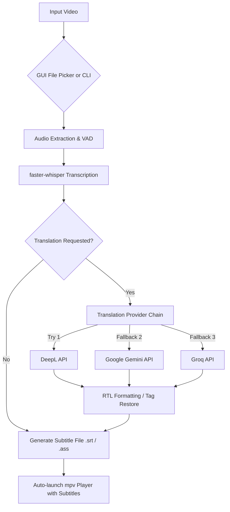

# 🎬 Autosub Player

[](https://www.python.org/)
[](https://opensource.org/licenses/MIT)
[](https://github.com/SYSTRAN/faster-whisper)
[](https://mpv.io/)
[](https://github.com/SDAIAAcademy)

**Autosub Player** is an intelligent, high-performance video subtitle generator and player. It transcribes audio tracks locally using [faster-whisper](https://github.com/SYSTRAN/faster-whisper), optionally translates subtitles using a resilient multi-provider AI translation fallback chain (**DeepL**, **Google Gemini**, and **Groq**), exports standard subtitle files (`.srt` / `.ass`), and automatically launches [mpv](https://mpv.io) with the subtitles loaded for seamless playback.

---

## 🌟 Key Features

- 🎙️ **High-Performance Local Speech Recognition**: Powered by `faster-whisper` and CTranslate2 with Voice Activity Detection (VAD) and automatic language detection.
- ⚡ **Hardware Acceleration**: Automatic GPU (`CUDA` / float16) acceleration with seamless fallback to CPU (`int8`).
- 🌐 **Multi-Provider AI Translation Chain**:
  - Resilient translation fallback across **DeepL**, **Google Gemini (Gemini 2.5 Flash)**, and **Groq (Llama 3.3 70B)**.
  - Automatic quota/rate-limit switching and retry mechanisms.
  - Subtitle styling tag preservation for `.ass` / `.srt` formats.
- 🌍 **RTL & Arabic Subtitle Support**: Built-in bidirectional unicode formatting (`\u202B...\u202C`) to ensure proper display of right-to-left languages like Arabic.
- 🎨 **Modern Dark-Themed GUI & CLI**: Includes a sleek desktop file picker for easy point-and-click usage as well as a comprehensive command-line interface.
- 📺 **Instant Playback**: Pre-loads generated subtitles directly into the lightweight `mpv` video player.
- 🚀 **One-Click Windows Launcher**: Comes with `Start.bat` to automatically set up the virtual environment, install requirements, and run the app.

---

## 🏗️ Architecture & Workflow



---

## 📋 Prerequisites & System Dependencies

### 1. Python
- **Python 3.10+** installed and added to your system `PATH`.

### 2. External Tools
- **[FFmpeg](https://ffmpeg.org/)**: Required by `faster-whisper` / `ctranslate2` for audio extraction and decoding. Must be on your system `PATH`.
- **[mpv](https://mpv.io/)**: Required for automatic video playback with subtitles pre-loaded. Must be on your system `PATH`.
- *(Linux only)* **Tkinter**: If running on Linux, install `python3-tk` (e.g., `sudo apt-get install python3-tk`).

### 3. GPU Acceleration (Optional)
- **NVIDIA GPU** with CUDA Toolkit and cuDNN for faster float16 transcription inference. (The app will automatically fall back to CPU `int8` if no GPU is detected).

---

## 🚀 Installation & Quick Start

### Option A: Windows One-Click Start (Recommended)
Simply double-click:
```bash
Start.bat
```
This script will automatically:
1. Create a Python virtual environment (`.venv`).
2. Install all required dependencies from `requirements.txt`.
3. Launch the Autosub Player GUI.

---

### Option B: Manual Setup

1. **Clone the repository:**
   ```bash
   git clone https://github.com/YOUR_USERNAME/audio-to-text.git
   cd "audio to text"
   ```

2. **Create and activate a virtual environment:**
   - **Windows:**
     ```bash
     python -m venv .venv
     .\.venv\Scripts\activate
     ```
   - **Linux / macOS:**
     ```bash
     python3 -m venv .venv
     source .venv/bin/activate
     ```

3. **Install Python dependencies:**
   ```bash
   pip install -r requirements.txt
   ```

---

## 🔑 Translation API Keys Setup (Optional)

To enable AI translation across multiple providers, set one or more of the following environment variables:

| Provider | Environment Variable | Model / Service |
| :--- | :--- | :--- |
| **DeepL** | `DEEPL_API_KEY` | DeepL Translation API |
| **Google Gemini** | `GEMINI_API_KEY` | `gemini-2.5-flash` |
| **Groq** | `GROQ_API_KEY` | `llama-3.3-70b-versatile` |

### Setting Environment Variables:

- **Windows (Command Prompt):**
  ```cmd
  set GEMINI_API_KEY=your_gemini_api_key_here
  set GROQ_API_KEY=your_groq_api_key_here
  set DEEPL_API_KEY=your_deepl_api_key_here
  ```
- **Windows (PowerShell):**
  ```powershell
  $env:GEMINI_API_KEY="your_gemini_api_key_here"
  $env:GROQ_API_KEY="your_groq_api_key_here"
  $env:DEEPL_API_KEY="your_deepl_api_key_here"
  ```
- **Linux / macOS (Bash/Zsh):**
  ```bash
  export GEMINI_API_KEY="your_gemini_api_key_here"
  export GROQ_API_KEY="your_groq_api_key_here"
  export DEEPL_API_KEY="your_deepl_api_key_here"
  ```

> *Note: If no translation API keys are configured, transcription will run normally without translation.*

---

## 💻 Usage

### 1. GUI Mode
Run the script without arguments to open the dark-mode configuration window:
```bash
python autosub_player.py
```
1. Select the **Source Language** (or leave as `Auto-detect`).
2. Select the **Translation Target Language** (optional).
3. Click **Browse for Video…** to choose your video file.
4. The transcription and translation will run automatically, saving the subtitle file next to the video and opening `mpv`.

---

### 2. Command Line Interface (CLI)

```bash
# Basic transcription and playback
python autosub_player.py --video "movie.mkv"

# Specify Whisper model and source language
python autosub_player.py --video "lecture.mp4" --model medium --lang en

# Transcribe and translate to Arabic with ASS subtitles
python autosub_player.py --video "clip.mp4" --target-lang ar --format ass

# Transcribe only (skip auto-playback) and specify custom output path
python autosub_player.py --video "talk.webm" --output "output/talk.srt" --no-play
```

### CLI Arguments Reference

| Argument | Type | Default | Description |
| :--- | :--- | :--- | :--- |
| `--video` | `str` | `None` | Path to video file. If omitted, opens the GUI file picker dialog. |
| `--model` | `str` | `small` | Whisper model size (`tiny`, `base`, `small`, `medium`, `large-v3`). |
| `--lang` | `str` | `None` | Source language ISO code (e.g., `en`, `ar`, `es`). Defaults to auto-detect. |
| `--target-lang` | `str` | `none` | Target language ISO code for translation (e.g., `ar`, `en`, `es`, `fr`, `de`, `zh-CN`). |
| `--format` | `str` | `srt` | Subtitle format: `srt` or `ass`. |
| `--output` | `str` | `None` | Explicit path where the subtitle file should be saved. |
| `--no-play` | `flag` | `False` | Skip launching `mpv` player after transcription. |

---

## 📁 Supported Formats

- **Video Containers**: `.mp4`, `.mkv`, `.avi`, `.mov`, `.webm`
- **Subtitle Output**: `.srt` (SubRip), `.ass` (Advanced SubStation Alpha)
- **Languages**: Arabic (`ar`), English (`en`), Spanish (`es`), French (`fr`), German (`de`), Italian (`it`), Portuguese (`pt`), Russian (`ru`), Japanese (`ja`), Korean (`ko`), Chinese Simplified (`zh-CN`), and all languages supported by Whisper.

---

## 🤝 Community & Acknowledgments

- Special acknowledgment and appreciation to the [**SDAIA Academy**](https://github.com/SDAIAAcademy) community for supporting AI education and innovation.
- Powered by [faster-whisper](https://github.com/SYSTRAN/faster-whisper) and [CTranslate2](https://github.com/OpenNMT/CTranslate2).
- Subtitle processing handled by [pysubs2](https://github.com/tkarabela/pysubs2).
- Video playback powered by [mpv](https://mpv.io).

---

## 📄 License

This project is licensed under the [MIT License](LICENSE).
